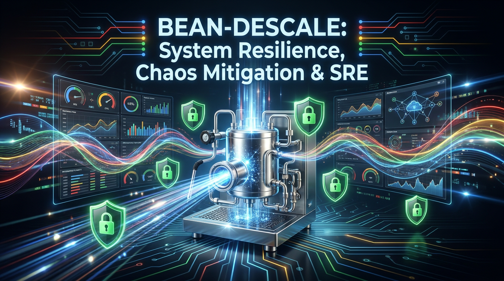
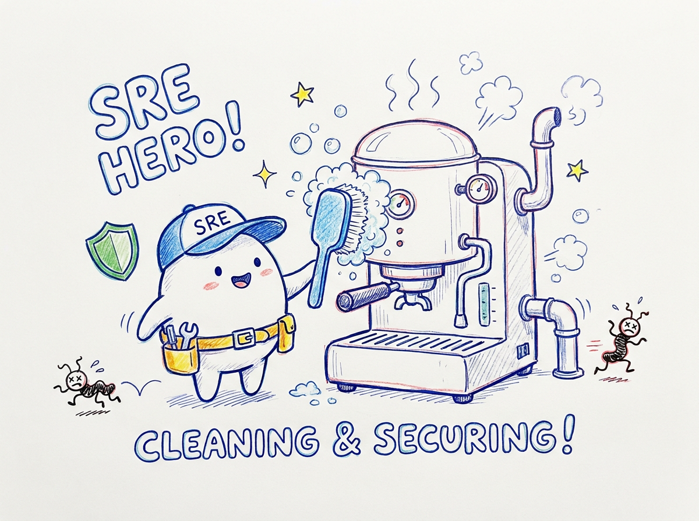
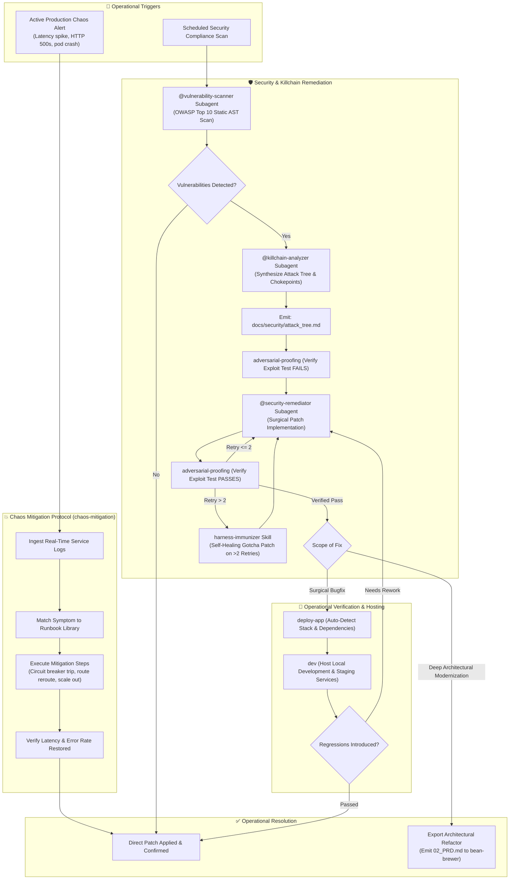

<p align="center">
  
</p>

# 🧼 Bean-Descale

> **System Resilience, Day 2 SRE, Chaos Mitigation, and Security Remediation Suite for Antigravity pipelines.**

---

## ☕ Why "The Descaler"? (The Metaphor Explained)

<p align="center">
  
</p>

In any commercial espresso machine, water heated under high pressure inevitably leaves behind calcium carbonate and mineral buildup (limescale). If left untreated, scale blocks heating elements, clogs group heads, causes solenoid valves to stick, and degrades brew quality until the machine fails. Descaling is the vital maintenance routine that cleans the pipes, dissolves scale, and restores full operational pressure.

In software engineering, running systems accumulate operational limescale: active chaos events, memory leaks, misconfigured circuit breakers, dependency vulnerabilities, and unpatched security debt.

**`bean-descale`** is the operational maintenance and SRE suite:
- It actively detects and mitigates runtime chaos events using structured runbooks.
- It scans codebases for OWASP Top 10 security vulnerabilities and structural flaws.
- It plans and applies verifiable security patches and brings up local development/staging stacks for resilience verification.

---

## 🏛️ Origin & Architectural Rationale

### Spawned from `bean-to-cup`
**`bean-descale`** was extracted from the monolithic [`bean-to-cup`](https://github.com/sapientcoffee/bean-to-cup) repository as part of a modular decomposition of the Antigravity barista swarm.

### Why Decompose?
1. **SRE & Security Specialization:** Site Reliability Engineers, platform teams, and security specialists need dedicated chaos mitigation and vulnerability remediation tooling without the overhead of feature ideation or PRD engines.
2. **Reduced Blast Radius:** Keeping emergency operational scripts, chaos incident handlers, and security scanners isolated ensures that maintenance workflows remain fast, deterministic, and dependable during outages.
3. **Decoupled Handoff to Implementation:** Incident post-mortems and security audits can either be remediated immediately in `bean-descale` or exported as structured `02_PRD.md` bugfix slices into `bean-brewer`.

---

## 🚀 Capabilities & Agents Reference

| Feature | Type | Description |
| :--- | :---: | :--- |
| **`chaos-mitigation`** | Skill | Detects, analyzes, and mitigates active chaos events in microservices (e.g., latency spikes, failure injection) using log forensics and predefined operational runbooks. |
| **`@vulnerability-scanner`** | Agent | Performs non-destructive static analysis and AST pattern matching to detect OWASP Top 10 vulnerabilities and hardcoded secrets. |
| **`@killchain-analyzer`** | Agent | Ingests vulnerability findings, synthesizes end-to-end exploit chains (Reconnaissance -> Weaponization -> Lateral Movement), writes `docs/security/attack_tree.md`, and identifies prioritized defense chokepoints. |
| **`adversarial-proofing`** | Skill | Enforces test-driven security remediation: verifies exploit test FAILS on unpatched code before applying surgical fix, then verifies it PASSES. |
| **`harness-immunizer`** | Skill | Extracts failure root causes upon repeated remediation retries (>2) and writes permanent architectural gotcha rules into `rules/gotchas/`. |
| **`@security-remediator`** | Agent | Executes verified, surgical security patches and updates dependency constraints without introducing functional regressions. |
| **`deploy-app` & `dev`** | Skills | Automatically detects tech stacks, configures local dependencies, and hosts services locally for operational verification. |

---

## 🔄 Detailed Incident Mitigation & Security Workflow



---

## 📦 Installation

```bash
# Install to local Antigravity plugin registry
./install.sh

# Or install via agy CLI
agy plugin install .
```

---

## 📜 License
Apache-2.0 - Copyright 2026 Google LLC.
